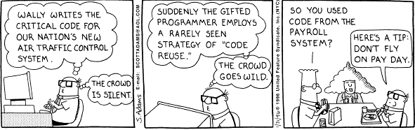

## The Three Rs
Growing up, I've heard the phrase Reduce, Reuse, Recycle repeated over and over. Believing that my contributions would help save the planet, I strove to do my part by meticulously repurposing and recycling "trash." Eventually, it became clear that my efforts put into recycling meant little, as recycling was mostly a hoax within my municipality. One way or another, my bottles and cans ultimately ended up in the landfill. Even with this newfound understanding regarding materials recycling, the phrase still lived on in my head. The idea would become useful later, once I began programming. 

## Reuse
Say you need to bring water with you to a workplace, you could be faced with two options. The first is to forge your own water bottle out of metal, costing large quantities of time and effort to produce a product which may be misshapen, or otherwise not function properly. Alternatively, you could just fill up an empty plastic water bottle. Unlike the metal bottle, this plastic one has been proven to be capable of storing water, is easily accessible, and requires little effort to obtain. Design patterns are much like the plastic bottle is to this water issue; proven and generalizable solutions to a common problem.

## Recycle
A problem may have an often used style of solution, such as the use of a fork or spoon to eat food. The use of the fork, spoon, or similar in this situation is a design pattern. Design patterns show up all the time in places like software development, where certain problems repeat themselves across separate projects. A social media page, an online shopping website, a virtual classroom site, and more all need a way to receive input on who the user, accessing the webpage, is. The most common design pattern found here is the use of a login page, which accepts a user's username and password in order to identify them. While each login page may have been customized to fit the theme, they share the same core traits. Similar design patterns exist, such as navbars, footers, and more, to solve other problems as well. Design patterns are everywhere. 

## Reduce
A design pattern is a pattern, not a strict formula. In order to make it fit the needs of a piece of software, the generalized solution must be reduced and adapted. In my own code, I have used many design patterns, such as the login solution mentioned earlier. In general, this pattern is all you need in order to solve a variation of this problem. However, the implementation of some design patterns, like navbars, aren't so simple. In each webpage I have designed, the navbar always varies. Sometimes, they must be green, sometimes they must be gray. They may have a logo image, sometimes text, sometimes neither. By reducing the scope of the design pattern, it can be adapted to follow a desired format. In the segments of code based upon the design pattern, the risk of bugs is low as it has already been proven, through use, to work.

Design patterns are powerful ways to speed up development and reduce risk. Clearly, The Three R's isn't just a green slogan, but a blue(screen) one as well. 
