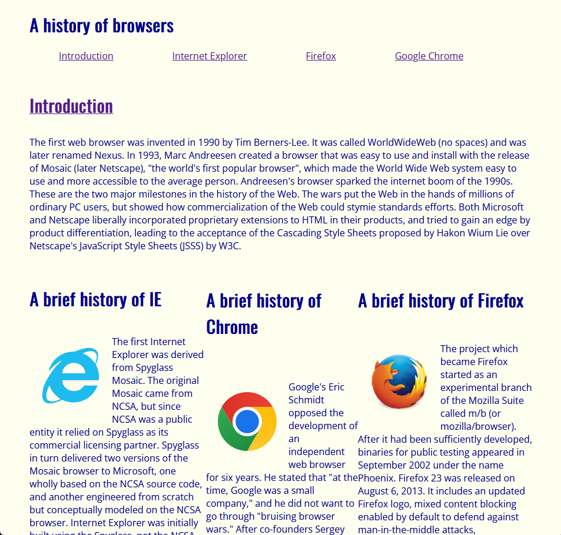

## HTML: Can we do better?

The first thought that came to mind after producing my first HTML + CSS project was "wow, that was confusing." The most recent thought that came to my mind after completing my most recent html project was "wow, that was also confusing, but slightly less so." Unlike in my prior experiences learning new programming languages, I have predominantly felt perplexion and frustration throughout my programming journey in HTML and CSS. It was difficult for me to predict what kind of changes my code would make to my webpage, and it was even harder trying to figure out how I should even program the page in the first place. While certainly an useful addition to a software developer's skillset, HTML is definitely not easy to learn.

## Theres a snake in my Boot(strap)

Eventually, I started working with Bootstrap. I would like to say that it made webpage designing easy, but thats not entirely true. While certainly easier by a great margin, the problems I previously encountered continued to manifest, although less often. I believe that this is improvement is due to the easier-to-use utility as an UI framework. 
The use of Bootstrap greatly simplifies webpage design, when compared to using just HTML, by making certain complex webpage features easier for the webpage designers to implement by doing much of the work for them. For example, I am just about clueless when it comes to creating a functioning, interactive navbar purely within HTML. With the help of Bootstrap's class system, I can do so with relative ease. 

Bootstrap can quickly help new HTMLers produce better webpages. The left webpage was made in HTML + CSS, the right was predominantly made with Bootstrap's help.

  
 
 
  
## Implications for Software Engineering

There are many advantages conferred by using a popular framework as compared to just the base product. One such advantage of Bootstrap is that the webpages made with it, as well as the code, begin to look similar to one-another. Many complicated tasks, which could have widely varying implementations in HTML, follow a similar structure when using Bootstrap's prebuilts. When it comes to maintaining projects, it is significantly better for the project to be written in a standardized way, following logic and style that is more mainstream rather than unique to the writer. If you generally use for loops, it'll be easier for you to read for loops than while loops. The same thing applies to coding styles. 
