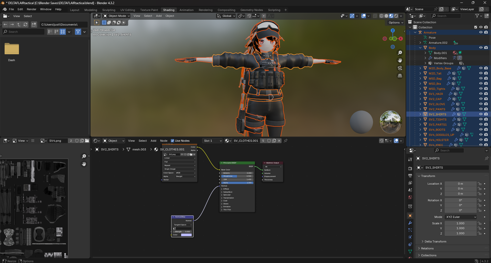
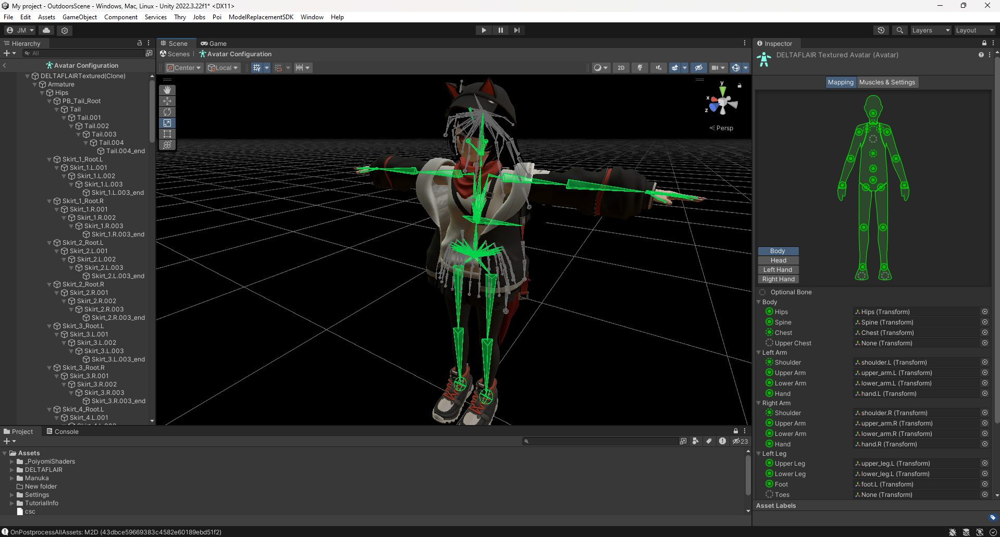

  
  

  Lethal Company is a 4-player cooperative video game that I play with friends. The game has a rich modding community which is constantly adding new content to the game and developing new methods to add even more features to the game. In January of 2024, the first releases of the tool "[ModelReplacementAPI](https://github.com/BunyaPineTree/LethalCompany_ModelReplacementAPI)" was made public by its developer BunyaPineTree. The tool allowed modders to swap out the players' in-game character models with custom models, but this process required (and still does) a lot of work in numerous modelling softwares. 

  In order to create model replacements, I had to teach myself how to use each of the numerous, upcoming pieces of community-developed tools and applications. The project almost always begins with the application "[Blender](https://www.blender.org/)," which is used in conjunction with various proprietary tools to convert models of various formats and their associated assets into formats usable by [Unity](https://unity.com/). For me, the most notable conversions includes using Nem's tools and Crowbar to extract mdl and vtx format assets, using blender source tools to translate these formats (used by the Source engine) into fbx and bake in their associated textures. fbx files are imported into unity, where the development part of ModelReplacementAPI is used to give the model the properties it needs to be read and used by the in-game part of the mod. Finally, Visual Studio is used to write the code that instructs the game to implement the model and its properties.

  This project has taught me how to work with 3d models and textures within Blender, and has granted me some insight into the operation of Unity, although such knowledge is currently basic. While working on the project, I have come to realize just how much work goes into the development of 3d assets. Although I have not yet created 3d models of my own, from the work I have done, I can tell that it is a long and arduous process. 
