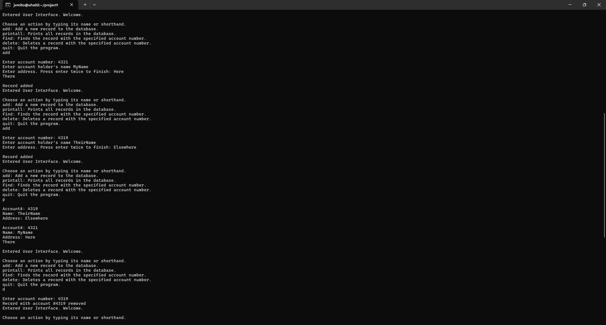
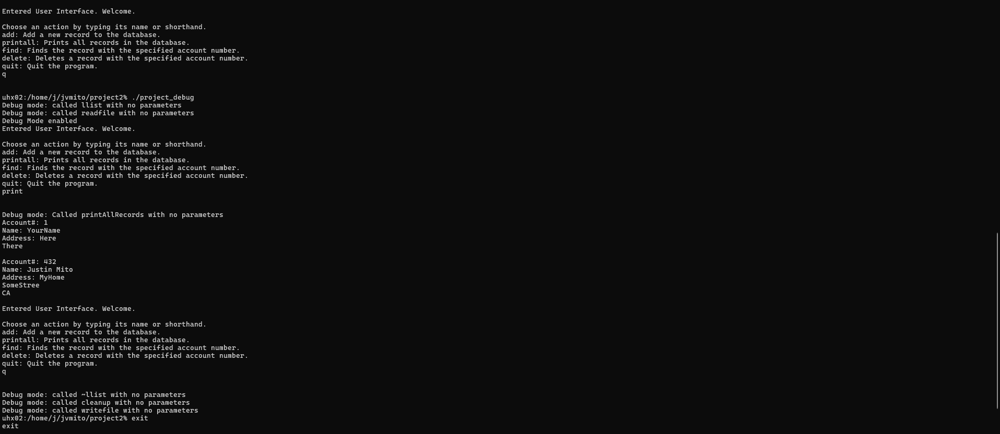

  
  

Over the course of a few weeks, I created this database, named project1, for ICS 212 in the Spring of 2024. Its most notable features are: a save function, so that members of the database would not be lost when the program is terminated, and the ability to create, delete, find, and display records using a text-based user interface. 

This project was an important milestone to me. Previously, I had written only small, isolated programs designed to perform small tasks. In the development of this project, I practiced planning out large pieces of software and implementing it. I also gained experience working in an Unix environment, writing code in C and Java, and using Makefiles.

