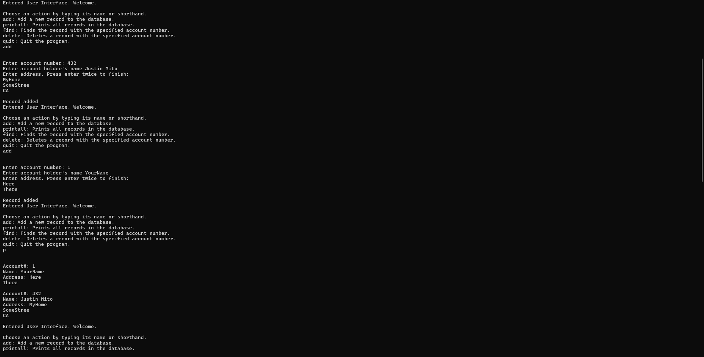
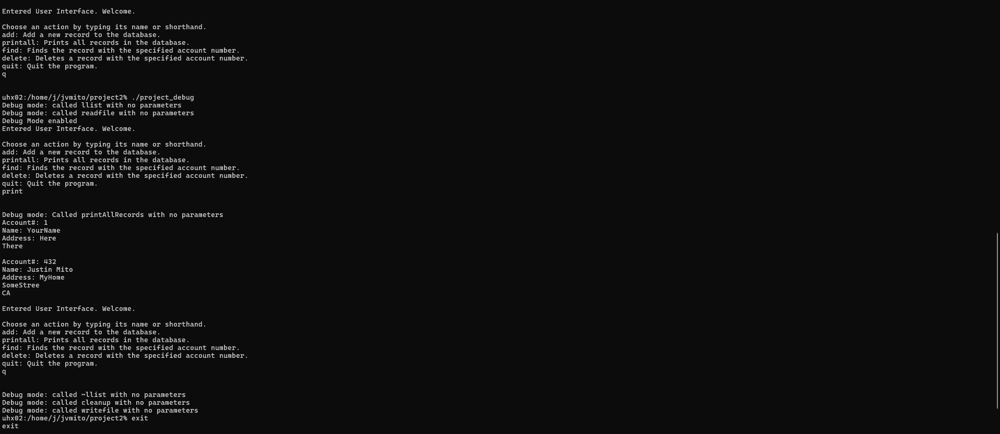

  
  

Over the course of a few weeks, I created this database, named project2, for ICS 212 in the Spring of 2024. Its most notable features are: a save function, so that members of the database would not be lost when the program is terminated, and the ability to create, delete, find, and display records using a text-based user interface. In its current state, it is capable of keeping records which consists of: an account number, the account holders name, and their address. The program also contains a debug feature to make facilitate development.

This project was the culmination of concepts I have studied and functions I have written throughout the course of the class. Written by me, it uses my approaches to program development and as such is uniquely mine.

This project was an important milestone to me. Previously, I had written only small, isolated programs designed to perform small tasks. In the development of this project, I practiced planning out large pieces of software and implementing it. I also gained experience working in an Unix environment with the VI text editor, writing code in C and C++, and using Makefiles.

Source: [https://github.com/justinvmito/Saving-Database](https://github.com/justinvmito/Saving-Database)
